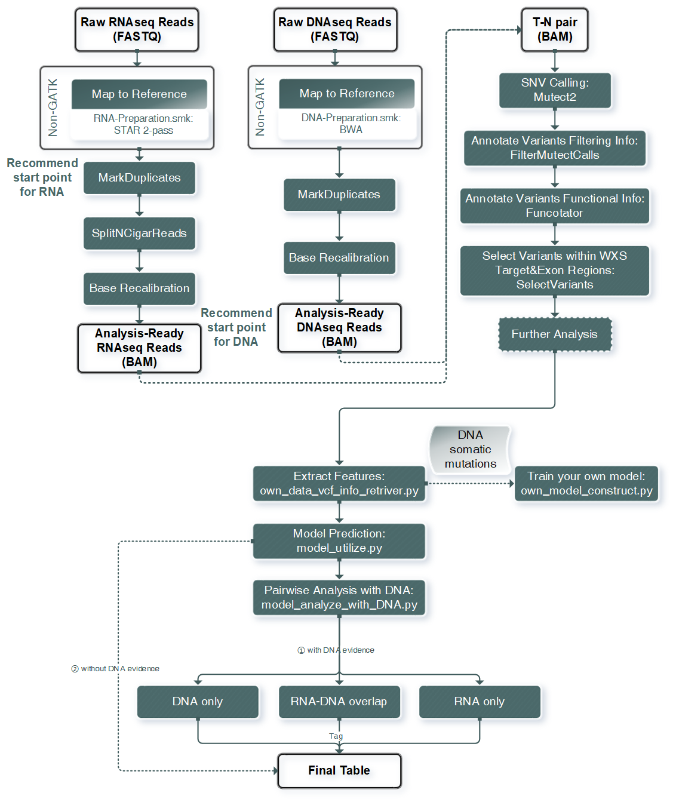

RNA-SSNV
=======================================================

The RNA-SSNV is a scalable and efficient analysis method for RNA somatic mutation detection from RNA-WES (tumor-normal) paired sequencing data which utilized Mutect2 as core-caller and Multi-filtering strategy & Machine-learning based model to maximize precision & recall performance. It runs highly automated once related configs & infos get configurated properly. It reports an aggregated mutation file (standard maf format) to facilitate downstream analysis and clinical decision. 

Important!!! This is the github repository storing **manual** and necessary codes for RNA-SSNV. The practical application was located within our `onedrive storage <https://github.com/broadinstitute/gatk/releases/download/4.1.6.0/gatk-4.1.6.0.zip>`_. 

Pre-requirements
~~~~~~~~~~~~~~~~~

Required Python Packages
--------------------------

.. code:: sh

  pip install -r requirements.txt

Modify config & table file
---------------------------

- *tables/project_RNA_somatic_calling_info.tsv*: project-related sequencing data information, modify under following instruction.

.. list-table:: Project RNA somatic calling  sample info
    :widths: auto
    :header-rows: 1
    :align: center

    * - file_name
      - file_id
      - aliquots_id
      - case_id
      - sample_type
    * - Name of bam file
      - Name of specific folder which contains bam file
      - ID of aliquot sequenced
      - ID of corresponding patient's case
      - Type of aliquot's origin. Be ware, tumor sample should be "Primary Tumor", paired-normal sample should be "Solid Tissue Normal" or "Blood Derived Normal". "Best Normal" sample **must** be included to support multi-sample calling. 

- *configs/project_config.yaml*: pipeline-related configurations, modify it accordingly. 

Run Framework
~~~~~~~~~~~~~~~

Once configurated correctly, our pipeline is ready to go. Please execute the following commands step by step, make sure everything works smoothly before moving forward. 

Call and annotate raw RNA somatic mutations
-----------------------------------------------

We assume that available RNA&DNA sequence data for common users were **aligned** RNA-seq data (bam format) and **co-cleaned analysis-ready** DNA-seq data (bam format) which were standard pre-process for TCGA. Once user correctly configurated our framework, calling and annotate raw RNA somatic mutations will be automatically conducted. 

.. code:: sh
    
    # dry run to see if the mutation calling pipeline works properly
    snakemake --cores {num_of_cores} \
    -ns rules/RNA-Somatic-tsv-Snakefile.smk \
    --configfile configs/project_RNA_Somatic_config.yaml

    # run the pipeline
    snakemake --cores {num_of_cores} \
    -s rules/RNA-Somatic-tsv-Snakefile.smk \
    --configfile configs/project_RNA_Somatic_config.yaml

Beware, thanks to the **breakpoint-run** feature of snakemake, our framework can save process-finished files and delete corrupted files automatically when accidental disruption (power failure or unintended termination) occurred. Just re-run the command and our framework will continue its unfinished works. 

In case of folders got locked after accidental disruption, *--unlock* and *--rerun-incomplete* option can be added during dry run to unlock corresponding folders.

Extract features for raw RNA somatic mutations
-----------------------------------------------

All parameters should be files or folders' absolute paths. 

.. code:: sh

    # run feature-extraction codes
    python lib/own_data_vcf_info_retriver.py \
    --cancer_type {your_specified_cancer_type} \
    --RNA_calling_info {your_RNA_calling_info} \
    --project_folder {your_project_folder} \
    --exon_interval {your_exon_interval} \
    --output_table_path {your_specified_feature_table_path} \
    --num_threads {num_of_threads}

Predict reliable RNA somatic mutations
------------------------------------------

For the generated result, records with **pred_label** being 1 should be considered as reliable RNA somatic mutations which were predicted to be positive with default 0.5 threshold. 

.. code:: sh

    # run model predicting codes
    python /home/lqh/Codes/Python/RNA-SSNV/model_utilize.py \
    --REDIportal resources/REDIportal_main_table.hg38.bed \
    --DARNED resources/DARNED_hg19_to_bed_to_hg38_rm_alt.bed \
    --raw_RNA_mutations {your_specified_feature_table_path} \
    --model_path model/exon_RNA_analysis_newer.model \
    --one_hot_encoder_path model/exon_RNA_analysis_newer.one_hot_encoder \
    --training_columns_path model/exon_RNA_analysis_newer.training_data_col \
    --output_table_path {your_specified_predicted_table_path}

Pairwise analysis for DNA and RNA somatic mutations (only do it with DNA evidence)
----------------------------------------------------------------------------------------

The combination of DNA and RNA somatic mutation can achieve **maximum performance** for mutational investigation. By incoporating DNA evidence into RNA somatic mutations, users can easily examine their intersectionality and validate their existence. 

Step 0: Prepare for essential data
^^^^^^^^^^^^^^^^^^^^^^^^^^^^^^^^^^^^^^

.. code:: sh

    python lib/Mutect2_calls_prepare_to_table.py \
    --cancer_type {your_cancer_type} \
    --project_folder {your_project_folder} \
    --RNA_calling_info {your_RNA_calling_info} \
    --output_file_path {your_specified_path_for_RNA_mutations_to_table}

Step 1: Generate RNA-omitted DNA mutations to force-call
^^^^^^^^^^^^^^^^^^^^^^^^^^^^^^^^^^^^^^^^^^^^^^^^^^^^^^^^^^^^^

Using **DNA evidence (mutations)** to generate RNA-omitted DNA mutations to force-call and retrieve their status within RNA sequence data. 

DNA mutations' required columns (maf format): "Tumor_Sample_UUID", "Chromosome", "Start_Position", "Reference_Allele", "Tumor_Allele1", "Tumor_Allele2"

.. code:: sh

    python model_analyze_with_DNA.py \
    --step 1 \
    --cancer_type {your_cancer_type} \
    --DNA_info {your_DNA_mutations} \
    --RNA_info {your_specified_predicted_table_path} \
    --WXS_target_interval resources/whole_exome_agilent_1.1_refseq_plus_3_boosters.targetIntervals_add_chr_to_hg38_rm_alt.bed \
    --exon_interval resources/GRCh38_GENCODE_v22_exon_rm_alt.bed \
    --RNA_calling_info {your_RNA_calling_info} \
    --RNA_bam_folder {your_project_folder}/{your_cancer_type}/RNA/apply_BQSR \
    --Mutect2_target_detected_sites {your_specified_path_for_RNA_mutations_to_table} \
    --project_folder {your_project_folder} \
    --num_threads {num_of_threads} \
    --output_file_path {your_specified_temporary_analysis_class_object}

Step 1.1: Force calling all DNA only mutations and extract features
^^^^^^^^^^^^^^^^^^^^^^^^^^^^^^^^^^^^^^^^^^^^^^^^^^^^^^^^^^^^^^^^^^^^^^^^^^^^^^^^^^

Modify config file for force-calling process

- *configs/project_force_call_config.yaml*: pipeline-related configurations, modify it accordingly. 

Afterwards, run commands sequencially to conduct force-calling of Mutect2 to query RNA coverage, allele depths for DNA only mutations.

.. code:: sh
    
    # dry run to see if the mutation calling pipeline works
    snakemake --cores {num_of_cores} \
    -ns rules/RNA-Somatic-tsv-Snakefile-force-call.smk \
    --configfile configs/project_force_call_config.yaml

    # run formally
    snakemake --cores {num_of_cores} \
    -s rules/RNA-Somatic-tsv-Snakefile-force-call.smk \
    --configfile configs/project_force_call_config.yaml

    # run feature extraction codes for force-called mutations' info
    python lib/force_call_data_vcf_info_retriver.py \
    --cancer_type {your_cancer_type} \
    --RNA_calling_info {your_RNA_calling_info} \
    --project_folder {your_project_folder} \
    --exon_interval resources//GRCh38_GENCODE_v22_exon_rm_alt.bed \
    --output_table_path {your_specified_force_called_table_path} \
    --num_threads {num_of_threads}

Step 2: Combine RNA force-called results with RNA somatic mutations to finalize RNA-DNA integrative analysis
^^^^^^^^^^^^^^^^^^^^^^^^^^^^^^^^^^^^^^^^^^^^^^^^^^^^^^^^^^^^^^^^^^^^^^^^^^^^^^^^^^^^^^^^^^^^^^^^^^^^^^^^^^^^^^^^^^^^^^^^^

.. code:: py

    python model_analyze_with_DNA.py \
    --step 2 \
    --force_call_RNA_info {your_specified_force_called_table_path} \
    --instance_path {your_specified_temporary_analysis_class_object} \
    --model_path models/exon_RNA_analysis_newer.model \
    --one_hot_encoder_path models/exon_RNA_analysis_newer.one_hot_encoder \
    --training_columns_path models/exon_RNA_analysis_newer.training_data_col \
    --output_file_path {your_specified_final_table_path}

Step 3: Add DNA coverage info from DNA sequence data to compare coverages for DNA-level and RNA-level (require the existence for DNA sequence data)
^^^^^^^^^^^^^^^^^^^^^^^^^^^^^^^^^^^^^^^^^^^^^^^^^^^^^^^^^^^^^^^^^^^^^^^^^^^^^^^^^^^^^^^^^^^^^^^^^^^^^^^^^^^^^^^^^^^^^^^^^^^^^^^^^^^^^^^^^^^^^^^^^^^^^^^^^^^^^^^^^^^^^^^^^^^^^^^^^^^^^^^^^^^^^^^^^^^^

.. code:: py

    python lib/result_adder.py \
    --result_info {your_specified_final_table_path} \
    --output_info {your_specified_final_table_with_DNA_coverage_path} \
    --add_type DNA \
    --DNA_calling_info {your_DNA_calling_info} \
    --DNA_tumor_folder {your_DNA_sequence_data_folder} \
    --num_threads {num_of_threads}

Train your own discriminant model
----------------------------------------------------------------------------------------

Although we used 511 cases of TCGA LUAD RNA-WES paired data to train our discriminant model, other non-cancerous RNA somatic mutations or non-bulk RNA-Seq (other sequencing technology) may exhibit **different patterns of FP calls**. In that case, our model may not served as expected, and a customized model can be trained on your own. 

Data-preparation
^^^^^^^^^^^^^^^^^^^

- Gold-standard TP mutations for your project (maf-format) with required five columns: "Chromosome", "Start_Position", "Tumor_Allele2", "Tumor_Allele1", "Tumor_Sample_UUID"

Train customized model
^^^^^^^^^^^^^^^^^^^^^^^^^^

- Using gold-standard TP mutations with their corresponding RNA somatic mutations to train customized model. The performance matrix for model training will be generated in the output information. 

  .. code:: sh
    
    # run feature-extraction codes
    python lib/own_data_vcf_info_retriver.py \
    --cancer_type {your_cancer_type} \
    --RNA_calling_info {your_RNA_calling_info} \
    --project_folder {your_project_folder} \
    --exon_interval resources/GRCh38_GENCODE_v22_exon_rm_alt.bed \
    --output_table_path {your_specified_feature_table_path} \
    --num_threads {num_of_threads}

    # train your own model
    python own_model_construct.py \
    --REDIportal resources/REDIportal_main_table.hg38.bed \
    --DARNED resources/DARNED_hg19_to_bed_to_hg38_rm_alt.bed \
    --raw_RNA_mutations {your_specified_feature_table_path} \
    --DNA_mutations {your_DNA_mutations} \
    --model_folder_path {your_specified_folder_path_to_store_trained_model}

Utilize customized model
^^^^^^^^^^^^^^^^^^^^^^^^^^

- Back to the beginning of our pipeline, edit the **model** absolute path, start our framework and good to go!

Output folders & files
~~~~~~~~~~~~~~~~~~~~~~~~~~

The pipeline outputs several folders containing intermediate files and **final** project-level mutations annotation file (following standard maf format). Here, we detailly describe the `results/` folder's schema. 

Sequencing data pre-process
------------------------------

- *results/project_name/RNA/marked_duplicates*: temporary folder containing MarkDuplicates tool's output.
- *results/project_name/RNA/splited_n_cigar_reads*: temporary folder containing SplitNCigarReads tool's output.
- `results/project_name/RNA/base_reclibrate`: temporary folder containing BaseRecalibrate tool's output.
- *results/project_name/RNA/apply_BQSR*: permanent folder containing ApplyBQSR tool's output, **final** files (bam format) used to call RNA somatic mutations, **applicable for other analysis**.

Calling process - called RNA somatic mutation
------------------------------------------------

- *results/project_name/RNA/RNA_somatic_mutation/Mutect2*: permanent folder containing Mutect2 tool's output. 
- *results/project_name/RNA/RNA_somatic_mutation/GetPileupSummaries*: permanent folder containing GetPileupSummaries tool's output (best normal sample's pileup summary info).
- *results/project_name/RNA/RNA_somatic_mutation/FilterMutectCalls*: permanent folder containing FilterMutectCalls tool's output, **final files (vcf format) used to discriminate true RNA somatic mutations**, applicable for other filtering strategy. 
- *results/project_name/RNA/RNA_somatic_mutation/Funcotator/SNP*: permanent folder containing Funcotator's annnotation info for raw RNA SNP calls. 
- *results/project_name/RNA/RNA_somatic_mutation/SelectVariants/SNP_WES_interval*: permanent folder containing raw RNA SNP calls subsetted via given WES target intervals. 
- *results/project_name/RNA/RNA_somatic_mutation/SelectVariants/SNP_WES_interval_exon*: permanent folder containing **final** raw RNA SNP calls subsetted by given WES target intervals and exon regions**.

Pipeline explaination
~~~~~~~~~~~~~~~~~~~~~~~~~

Essential codes
------------------

- *rules/RNA_Somatic-tsv-Snakefile.smk* & *rules/RNA_Somatic-tsv-Snakefile-force-call.smk*: snakemake-style codes to describe our whole RNA somatic mutation calling pipeline (modify at your own risk!!!). 
- *lib/own_data_vcf_info_retriver.py*&*lib/force_call_data_vcf_info_retriver.py*: python codes to extract features (variant, genotype and annotation level) from different data sources. 
- *model_utilize.py*: python codes to predict the probability and labels of given Mutect2 calls. 

Pre-trained models
----------------------

- *models/exon_RNA_analysis_newer.one_hot_encoder*: one-hot encoder which adapted to following model. 
- *models/exon_RNA_analysis_newer.model*: random forest discriminant model trained using whole TCGA LUAD project data. 
- *exon_RNA_analysis_newer.training_data_col*: column names used in model training and prediction

Resource files
------------------

- *resources/whole_exome_agilent_1.1_refseq_plus_3_boosters.targetIntervals_add_chr_to_hg38_rm_alt.bed*: bed-format interval file for paired-normal Whole Exome Sequence(WES) targets. (canonical for TCGA projects)
- *resources/GRCh38_GENCODE_v22_exon_rm_alt.bed*: bed-format interval file for GENCODE v22 exon regions. 